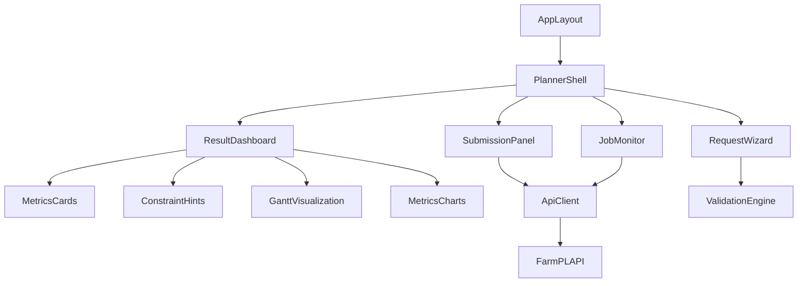

# Design Document

## Overview
FarmPL営農プランニングUIは、Next.js App Routerを用いた単一ページアプリケーションとして構築し、`api/`が提供する営農計画最適化APIを操作・可視化するフロントエンドレイヤーです。主なユーザーフローは、(1) 最適化リクエストの作成・編集、(2) 同期/非同期実行と進捗管理、(3) 最適化結果の可視化（ガントチャート・メトリクス・制約ヒント）です。UIはデスクトップ/タブレット/モバイルを想定したレスポンシブレイアウトを採用し、農業ドメインユーザーが現場でも利用できることを目指します。

## Steering Document Alignment

### Technical Standards (tech.md)
- API呼び出しはHTTPS前提で行い、FastAPIベースの`/v1/optimize/async`とジョブ管理エンドポイントに準拠した型安全なクライアントを提供する。
- Pydanticスキーマと整合するTypeScript型を生成/管理し、エラー時はユーザーフレンドリーなメッセージを表示する。
- ローカル実行を主眼としつつ、将来のAPIサービス化に耐える構成（リトライ・ポーリング・キャンセル）を整備する。

### Project Structure (structure.md)
- `ui/`配下にApp Router構成を採用し、レイアウト・ページ・コンポーネントを責務ごとに分割する。
- 公開API層 (`api-client`) と表示コンポーネント層 (`components/*`) を厳格に分離し、再利用性とテスタビリティを確保する。
- 1ファイル1責務、単一責任原則に従い、フォームロジック・ポーリングロジック・可視化を独立モジュール化する。

## Code Reuse Analysis
既存のNext.js初期テンプレートのみが存在するため、既存コンポーネントの直接流用は行わない。ただし以下の資産を活用する。

### Existing Components to Leverage
- **Tailwind CSS (v4)**: 既存設定を活かし、デザインシステムのユーティリティクラスとして使用する。
- **APIスキーマ (`api/schemas/optimization.py`)**: Pydanticモデル定義を参照し、TypeScript型生成とバリデーションルールに利用する。

### Integration Points
- **FarmPL API (`/v1/optimize/async`, `/v1/jobs/{id}`)**: フロントエンドのHTTPクライアントが統合する主要エンドポイント。
- **ローカルストレージ**: 下書き保存・設定保持用に使用（永続DBは導入しない）。

## Architecture
UI全体はレイヤードに構成する。

1. **Presentation Layer**: レイアウト・ページ・表示コンポーネント群。
2. **State & Data Layer**: リクエストフォーム状態、ポーリング状態、テーマ設定を管理するストア（ZustandまたはReact Context + Reducer）。
3. **Service Layer**: APIクライアント、ポーリングサービス、ダウンロードユーティリティ。
4. **Validation Layer**: Zod等を利用してPydantic互換の型チェックを行うモジュール。

レスポンシブ対応として、CSS GridとFlexboxを組み合わせ、`minmax`を使ったガントチャートレイアウトと、Cardベースのメトリクス表示をBreakpoints (`sm`, `md`, `lg`, `xl`) ごとに最適化する。モーション・配色はモダンなダーク/ライトテーマ切り替えに対応する。



## Components and Interfaces

### AppLayout
- **Purpose:** 全体レイアウト・テーマ切替・レスポンシブBreakpointの管理。
- **Interfaces:** `AppLayout({ children })`
- **Dependencies:** Next App Router `layout.tsx`, Tailwindテーマクラス。
- **Reuses:** テーマスイッチャー・メタ情報設定。

### PlannerShell
- **Purpose:** ページ全体のレイアウト。Requestフォーム、送信パネル、ジョブ監視、結果ダッシュボードをレスポンシブに配置。
- **Interfaces:** `PlannerShell()`
- **Dependencies:** Stateストア、`useMediaQuery`フック。
- **Reuses:** 共通カード/パネルコンポーネント。

### RequestWizard
- **Purpose:** `OptimizationRequest.plan`スキーマに準拠したステップ型フォーム（セクション: Horizon、Crops、Events、Lands、Workers、Resources、Constraints）。
- **Interfaces:** `RequestWizard({ draftId? })`
- **Dependencies:** `useRequestFormStore`, `ValidationEngine`, `FormSection`サブコンポーネント。
- **Reuses:** 入力コンポーネント（Select、TagInput、DayRangePicker）。

### SubmissionPanel
- **Purpose:** 安全な送信。
- **Interfaces:** `SubmissionPanel()`
- **Dependencies:** `ApiClient`, `useMutation`（React Query）
- **Reuses:** Policy Tooltipコンポーネント、Key生成ユーティリティ。

### JobMonitor
- **Purpose:** 非同期ジョブのポーリング、キャンセル操作、ステータス表示。
- **Interfaces:** `JobMonitor({ jobId })`
- **Dependencies:** `ApiClient`, `usePolling`フック。
- **Reuses:** ステータスタグ、ProgressBar。

### ResultDashboard
- **Purpose:** `OptimizationResult` を可視化する親コンポーネント。
- **Interfaces:** `ResultDashboard({ result })`
- **Dependencies:** `MetricsCards`, `ConstraintHints`, `GanttVisualization`, `MetricsCharts`。
- **Reuses:** 共通カード枠・タブコンポーネント。

### MetricsCards
- **Purpose:** ステータス・目的値・ステージ統計をカードで提示。
- **Interfaces:** `MetricsCards({ status, objectiveValue, stats })`
- **Dependencies:** `StatusBadge`, `StageProgressList`。
- **Reuses:** 数値フォーマッター。

### ConstraintHints
- **Purpose:** `solution.constraint_hints` を優先度順に表示し、該当入力セクションへスクロールリンク。
- **Interfaces:** `ConstraintHints({ hints })`
- **Dependencies:** `useScrollToSection`。
- **Reuses:** Listコンポーネント。

### GanttVisualization
- **Purpose:** `timeline.land_spans` と `timeline.events` を可視化するガントチャート。
- **Interfaces:** `GanttVisualization({ spans, events, filters })`
- **Dependencies:** `@visx/visx` もしくは `d3`ベースの独自描画、`useTooltip`, `useResizeObserver`。
- **Reuses:** カラーパレットユーティリティ。

### MetricsCharts
- **Purpose:** 目的関数メトリクスやリソース使用量をチャートで表示。
- **Interfaces:** `MetricsCharts({ summary, stats })`
- **Dependencies:** 同上チャートライブラリ。
- **Reuses:** 同一カラーパレット、Legendコンポーネント。

### ValidationEngine
- **Purpose:** Zodによるオブジェクトスキーマ検証、Pydanticと整合するクロスチェック。
- **Interfaces:** `validatePlan(plan: PlanFormState): ValidationResult`
- **Dependencies:** `zod`, 変換ユーティリティ。
- **Reuses:** 型定義。

## Data Models

### PlanFormState
```
interface PlanFormState {
  horizon: { numDays: number };
  crops: Array<{ id: string; name: string; category?: string; price: { unit: 'a' | '10a'; value: number } }>;
  events: Array<{ id: string; cropId: string; name: string; startCond?: number[]; endCond?: number[]; frequencyDays?: number; precedingEventId?: string; lag?: { min?: number; max?: number }; labor?: { peopleRequired?: number; totalPerA?: number; dailyCap?: number }; usesLand: boolean; occupancyEffect?: 'start' | 'hold' | 'end' | 'none'; requiredRoles?: string[]; requiredResources?: string[] }>;
  lands: Array<{ id: string; name: string; area: { unit: 'a' | '10a'; value: number }; tags?: string[]; blockedDays?: number[] }>;
  workers: Array<{ id: string; name: string; roles: string[]; capacityPerDay: number; blockedDays?: number[] }>;
  resources: Array<{ id: string; name: string; category?: string; capacityPerDay?: number; blockedDays?: number[] }>;
  cropAreaBounds: Array<{ cropId: string; minArea?: { unit: 'a' | '10a'; value: number }; maxArea?: { unit: 'a' | '10a'; value: number } }>;
  fixedAreas: Array<{ landId: string; cropId: string; area: { unit: 'a' | '10a'; value: number } }>;
  preferences?: { wProfit: number; wLabor: number; wIdle: number; wDispersion: number; wPeak: number; wDiversity: number };
  stages?: { stageOrder: string[]; toleranceByStage?: Record<string, number>; stepToleranceBy?: Record<string, number> };
}
```

### OptimizationResultView
```
interface OptimizationResultView {
  status: 'ok' | 'infeasible' | 'timeout' | 'error';
  objectiveValue?: number;
  summary?: Record<string, unknown>;
  constraintHints?: Array<{ id: string; priority: number; message: string; targetSection?: string }>;
  stats: {
    stages?: Array<{ name: string; value: number; locked?: boolean }>;
    stageOrder?: string[];
  };
  timeline?: {
    landSpans: Array<{ landId: string; cropId: string; startDay: number; endDay: number; areaA: number }>;
    events: Array<{ day: number; eventId: string; cropId: string; landId?: string; workerIds: string[]; resourceIds: string[] }>;
  };
}
```

## Error Handling

### Error Scenarios
1. **APIバリデーションエラー (400/422)**
   - **Handling:** `ValidationEngine`で事前検知し、それでも発生した場合はレスポンスのエラー詳細をフォーム項目にマッピング。
   - **User Impact:** フォーム上部のアラートと該当フィールドのエラーメッセージが表示され、送信は保留。

2. **ジョブタイムアウト/キャンセル**
   - **Handling:** ポーリング結果で `timeout` / `canceled` を検出後、再試行手順と推奨設定をトースト通知＋ステータスカードで表示。
   - **User Impact:** 明示的に再送信ボタンとガイドリンクが提示される。

3. **ネットワークエラー/認証失敗**
   - **Handling:** APIクライアントが指数バックオフ（最大3回）を実施し失敗した場合、再試行ボタンとAPIキー再入力モーダルを表示。
   - **User Impact:** 操作は中断するが、フォーム内容は保持される。

## Testing Strategy

### Unit Testing
- `ValidationEngine`のスキーマ検証、フォームステップのナビゲーション、Idempotency Key生成ユーティリティをVitestでテスト。
- 主要コンポーネント（RequestWizardセクション、GanttVisualizationのスケール計算）をReact Testing Libraryで描画テスト。

### Integration Testing
- `SubmissionPanel`と`ApiClient`の統合をMSWでモックし、送信→結果反映のフローを検証。
- `JobMonitor`のポーリングロジック、キャンセル操作、状態遷移をテスト。

### End-to-End Testing
- Playwrightを用い、「新規リクエスト作成→非同期送信→結果閲覧→エクスポート」および「バリデーションエラー表示」のユーザーフローを自動化。
- 主要ブレークポイント（モバイル幅 <768px、タブレット 768-1024px、デスクトップ ≥1024px）でのレイアウト検証を行う。
