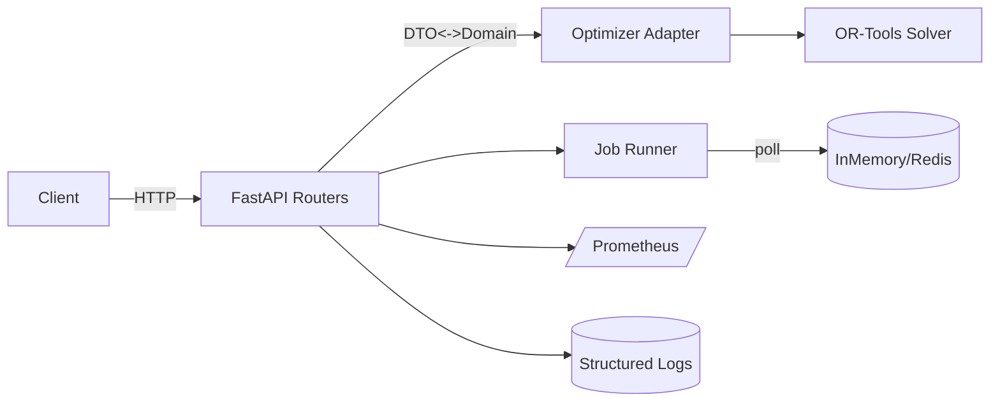

# Design Document

## Overview

既存の最適化エンジン（OR-Toolsベース）をFastAPIでWeb API化する。同期実行と非同期ジョブ投入をサポートし、API層・アダプタ層・ドメイン層を分離するクリーンアーキテクチャ寄りの構成を採用。`.cursor` のプロジェクト構造/ガイドライン（FastAPI採用、`api/` 配下、pytest）に準拠する。

## Steering Document Alignment

### Technical Standards (tech.md)
- FastAPI + Pydantic v2系（プロジェクト既定のバージョンに追従）。
- OR-Tools によるCP-SAT最適化をドメイン層で継続利用。
- 観測性：構造化ログ、/metrics にPrometheusエクスポート。

### Project Structure (structure.md)
- `.cursor/rules/project-structure.mdc` に準拠。
- 主要配置（新規/改修）：
  - `api/main.py`：ASGIエントリポイント（既定）。
  - `api/app.py`：アプリ生成（ミドルウェア、ルータ、バージョニング）。
  - `api/routers/optimize.py`：同期/非同期の最適化エンドポイント。
  - `api/routers/system.py`：`/healthz`, `/readyz`, `/metrics`。
  - `api/schemas/optimization.py`：リクエスト/レスポンスPydanticモデル。
  - `api/services/optimizer_adapter.py`：既存OR-Toolsロジック呼出しアダプタ。
  - `api/services/job_runner.py`：非同期ジョブ投入・状態管理（プラガブル）。
  - `api/core/{config,auth,errors,logging,metrics}.py`：共通基盤。
  - `api/tests/`：pytest によるユニット/APIテスト。

## Code Reuse Analysis

### Existing Components to Leverage
- `api/lib/solver.py` 他 OR-Tools 関連（`api/lib/*`）。最適化のドメイン実装として再利用。
- `api/docs/model.md` のモデル定義や用語をAPIスキーマに反映。

### Integration Points
- 最適化呼出し：`optimizer_adapter` → `api/lib/solver.py`（I/O変換はアダプタに集約）。
- 非同期実行：デフォルトはインメモリ・スレッドプール。将来は `Redis + RQ/Celery` に差し替え可能なポートを定義。
- メトリクス：`prometheus_client` を `/metrics` にマウント。

## Architecture

- 層分離：API層（FastAPI）／アダプタ層（DTO<->ドメイン変換）／ドメイン層（OR-Tools）／インフラ層（ジョブキュー/キャッシュ）。
- 契約駆動：Pydanticモデルで入出力契約を固定し、OpenAPIを自動生成。
- セキュリティ：API Key or Bearer Token を依存注入で強制。レート制限は将来拡張可能なミドルウェアスロットを用意。

### Modular Design Principles
- Single File Responsibility / Component Isolation / Service Layer Separation / Utility Modularity を遵守。

## Components and Interfaces

### `api/app.py`
- Purpose: FastAPIアプリ生成、CORS、ミドルウェア、ルータ登録。
- Interfaces: `create_app()` -> `FastAPI`。
- Dependencies: `core.config`, `core.logging`, `core.metrics`, `routers.*`。

### `api/routers/optimize.py`
- Purpose: 最適化API。
- Interfaces:
  - `POST /optimize`（同期）
  - `POST /optimize/async`（非同期ジョブ投入）
  - `GET /jobs/{job_id}`（状態/結果取得）
  - `DELETE /jobs/{job_id}`（キャンセル）
- Dependencies: `schemas.optimization`, `services.optimizer_adapter`, `services.job_runner`, `core.auth`。

### `api/routers/system.py`
- Purpose: 運用系エンドポイント。
- Interfaces: `GET /healthz`, `GET /readyz`, `GET /metrics`。
- Dependencies: `core.metrics`, `core.config`。

### `api/schemas/optimization.py`
- Purpose: Pydanticモデル。
- Interfaces:
  - `OptimizationRequest`（パラメータ、制約、上限制約、冪等性キー、タイムアウトms、優先度）
  - `OptimizationResult`（目的値、解、ステータス、統計、警告）
  - `JobInfo`（job_id, status, progress, submitted_at, completed_at, result?）
- Dependencies: Pydantic v2。

### `api/services/optimizer_adapter.py`
- Purpose: DTO<->ドメイン間の変換および `lib/solver.py` 呼出し。
- Interfaces:
  - `solve_sync(req: OptimizationRequest) -> OptimizationResult`
  - `solve_blocking(params: dict) -> dict`（内部）
- Dependencies: `api/lib/*`（OR-Tools）。

### `api/services/job_runner.py`
- Purpose: 非同期ジョブの登録・進捗・状態管理。
- Interfaces:
  - `enqueue(req: OptimizationRequest) -> JobInfo`
  - `get(job_id: str) -> JobInfo`
  - `cancel(job_id: str) -> bool`
- Implementation:
  - デフォルト：`ThreadPoolExecutor + InMemoryStore`（プロセス内）。
  - 拡張：`Redis + RQ/Celery` 用の`JobBackend`プロトコルを定義して差し替え。

### `api/core/auth.py`
- Purpose: API Key or Bearer Token の依存注入。
- Interfaces: `get_current_token()` で要求ヘッダ検証。

### `api/core/errors.py`
- Purpose: 例外マッピング。
- Interfaces: `DomainError`→HTTP 4xx/5xx、`ValidationError`→422、`RateLimitExceeded`→429。

### `api/core/metrics.py`
- Purpose: リクエスト/レイテンシ/エラー率/ジョブ時間を収集。
- Interfaces: Prometheus `Counter/Histogram/Gauge` のラッパ、`/metrics` エンドポイント公開。

### `api/core/config.py`
- Purpose: 設定（ENV優先）。
- Keys: `API_KEYS`, `AUTH_MODE`, `MAX_JSON_MB`, `SYNC_TIMEOUT_MS`, `ASYNC_TIMEOUT_S`, `JOB_BACKEND`, `REDIS_URL` など。

## Data Models

### OptimizationRequest
- `idempotency_key: str | None`
- `params: dict[str, Any]`（ドメイン入力）
- `timeout_ms: int | None`
- `priority: int | None`

### OptimizationResult
- `status: Literal["ok","infeasible","timeout","error"]`
- `objective_value: float | None`
- `solution: dict[str, Any] | None`
- `stats: dict[str, Any]`（計算時間、ノード数 等）
- `warnings: list[str]`

### JobInfo
- `job_id: str`
- `status: Literal["pending","running","succeeded","failed","timeout","canceled"]`
- `progress: float`
- `result: OptimizationResult | None`
- `submitted_at: datetime`
- `completed_at: datetime | None`

## Error Handling

### Error Scenarios
1. 入力検証失敗（422）
   - Handling: Pydantic検証 + 問題詳細JSON。
   - User Impact: フィールド別エラー表示。
2. ドメイン例外（400/409）
   - Handling: `DomainError(code, message)` をHTTPへマッピング。
   - User Impact: エラーコードと説明。
3. タイムアウト（408 or 200+`status=timeout`）
   - Handling: `timeout_ms` 超過時は中断。
   - User Impact: ステータス通知。
4. 内部エラー（500）
   - Handling: トレーサID付き構造化ログ、スタックトレース非公開。

## Testing Strategy

### Unit Testing
- スキーマ検証、アダプタのI/O変換、`lib/solver.py` の最小ケース。

### Integration Testing
- `POST /optimize` 正常/バリデーション/タイムアウト。
- 非同期フロー：enqueue → poll → 完了/失敗/キャンセル。

### End-to-End Testing
- サンプルデータでの最適化シナリオ。認可（Bearer）あり/なし。
- /healthz, /readyz, /metrics の確認。
