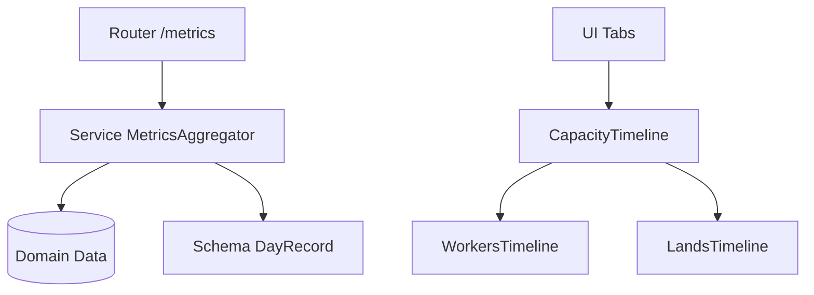

# Design Document

## Overview

本設計は、日別/旬別の2軸で「作業者稼働（時間）」と「土地使用率（面積）」をキャパ対比で可視化するダッシュボード機能を、API（FastAPI, Pydantic）とUI（Next.js/React, TypeScript）に疎結合で実装する。APIは`api/services/job_backend.py`に保持されるジョブの入力（plan）と出力（result/timeline）の“生データに近い中間表現”を用いて、その場で集計（bucketing）を行い`DayRecord`系列を返す。UIは3系統（イベント/作業者/土地）のタイムラインレンダリングを担い、ハイライトやoverフラグ等の強調は行わない。

## Steering Document Alignment

### Technical Standards (tech.md)
- Python 3.13 + Pydantic v2によりスキーマを厳密化。
- FastAPIで`/metrics/timeline`（GET）を提供。整形はサービス層（`api/services`）。
- UIは既存のNext.js構成に準拠し、再利用可能なタイムライン描画コンポーネントを追加。

### Project Structure (structure.md)
- API: `api/schemas/optimization.py`（または専用スキーマモジュール）に、レスポンス用の軽量ビュー・モデル（DayRecord群）を追加（over/バージョン番号は不要）。
- API: `api/services/metrics_aggregator.py` を新設し、`job_backend`の `JobInfo(result, req)` を入力に集計（day/decade）を実装（再最適化なし）。
- API: ルータ `api/routers/metrics.py` を追加し `api/main.py` に登録。
- UI: `ui/app/(planning)/components/metrics/` 配下に`CapacityTimeline.tsx`（共通）と`WorkersTimeline.tsx`/`LandsTimeline.tsx`を追加。
- UI: 既存`MetricsCharts.tsx`/ガント用コンポーネントと同居し、Tab + Toggleで切替。

## Code Reuse Analysis

### Existing Components to Leverage
- UI ガント: `ui/app/(planning)/components/gantt/*` のスケール/ビューモデルの考え方を流用（`timeline-scale.ts`）。
- UI メトリクス枠: `ui/app/(planning)/components/metrics/MetricsCharts.tsx` に導線（Tab/Toggle）を実装し、内部で新Timelineを呼び出す。
- 型: `ui/lib/types/*` に整形用型を追加し、既存`result-mapper.ts`の流れに沿ってAPIレスポンスをUI型へ写像。

### Integration Points
- API ルータ登録: `api/main.py` に`include_router(metrics_router, prefix="/metrics")`。
- バージョンフィールドはレスポンスに含めない（不要）。

## Architecture

- API層
- ルート: `GET /metrics/timeline?job_id=xxx&start=YYYY-MM-DD&end=YYYY-MM-DD&bucket=day|decade`
- サービス: `MetricsAggregator.aggregate(job_id, start, end, bucket) -> list[DayRecord]`
  - スキーマ: `DayRecord`, `EventMetric`, `WorkerMetric`, `LandMetric`, `TimelineResponse`（バージョン/overなし）
  - 方針: 集計はすべてAPIで実施し、最適化の再実行は行わない。`job_backend`の `req.plan` と `result.timeline` を用いる。
- UI層
  - データ取得: 非同期最適化 `/v1/optimize/async` の応答で `job_id` を保持し、`fetch /metrics/timeline` を `job_id` ベースで実行。`job_id` はストア（`usePlanningStore.lastJobId`）に保存し、ダッシュボードの `MetricsCharts` に配線する。UIでの集計/変換は行わず、常にAPI集計結果を使用。
  - 表示: Tab（イベント/作業者/土地） + Toggle（日/旬）。
  - 描画: 共通`CapacityTimeline`で軸/スケール/凡例を統一、`WorkersTimeline`/`LandsTimeline`はデータマッピングのみ（ハイライトやover強調は行わない）。

### Modular Design Principles
- Single File Responsibility: 集計ロジックは`metrics_aggregator.py`に集約。
- Component Isolation: タイムライン描画は共通コンポーネント + 薄いアダプタ。
- Service Layer Separation: ルータ→サービス→スキーマのレイヤ分離。
- Utility Modularity: 旬（decade）キー生成はユーティリティ化。



## Components and Interfaces

### API: Pydantic Schemas（例）
- `class EventMetric(BaseModel): id:str, label:str, start:date, end:date, type:str`
- `class WorkerMetric(BaseModel): worker_id:str, name:str, utilization:float, capacity:float`
- `class LandMetric(BaseModel): land_id:str, name:str, utilization:float, capacity:float`
- `class DayRecord(BaseModel): interval:Literal['day','decade']; date:date|None; period_key:str|None; events:list[EventMetric]; workers:list[WorkerMetric]; lands:list[LandMetric]; summary:Summary`
- `class TimelineResponse(BaseModel): interval:Literal['day','decade']; records:list[DayRecord]`

### API: Router
- `GET /metrics/timeline` → 200: `TimelineResponse`
- クエリ: `job_id`, `start`, `end`, `bucket`（`day|decade`）

### API: Service
- `MetricsAggregator.aggregate(start:date, end:date, bucket:'day'|'decade') -> list[DayRecord]`
- 責務: 入力イベント/作業者/土地のRAWデータを整形・集約・over判定。

### UI: Types（例）
- `type CapacityPoint = { key:string; used:number; cap:number }`
- `type TimelineSeries = { label:string; points:CapacityPoint[] }`

### UI: Components
- `CapacityTimeline.tsx`（共通描画：軸・凡例・サマリー。over強調・エクスポートはなし）
- `WorkersTimeline.tsx`（series変換：`records[].workers` → `TimelineSeries[]`）
- `LandsTimeline.tsx`（series変換：`records[].lands` → `TimelineSeries[]`）
- 既存`MetricsCharts.tsx`にタブ/トグルUIを実装し上記を組み込み。
 - `RequestWizard` は同期最適化ではなく `POST /v1/optimize/async` を呼び、`/v1/jobs/{id}` をポーリングして `result` を取得・保存。同時に `job_id` をストアへ保存し、ダッシュボードに渡す。

## Data Models

### TimelineResponse
```
{
  "interval": "day"|"decade",
  "records": DayRecord[]
}
```

### DayRecord（再掲）
```
{
  "interval": "day",
  "date": "2025-03-05",
  "events": [...],
  "workers": [
    {"worker_id":"w1","name":"A","utilization":6,"capacity":8,"over":false}
  ],
  "lands": [
    {"land_id":"l1","name":"F1","utilization":1.2,"capacity":1.5,"over":false}
  ],
  "summary": {
    "labor_total_hours": 48,
    "labor_capacity_hours": 64,
    "land_total_area": 12.3,
    "land_capacity_area": 15.0
  }
}
```

## Error Handling

### Error Scenarios
1. Invalid bucket
   - Handling: 400 + 明示メッセージ（`bucket must be 'day' or 'decade'`）
   - User Impact: UIはトースト表示、`day`にフォールバック提案
2. Large range
   - Handling: 413/422 + 上限ガイド（例: 最大370日）
   - User Impact: UIに範囲縮小のヒント
3. Missing or unknown job_id
   - Handling: 404/422。UIは再読込/再実行の導線を出す。

## Testing Strategy

### Unit Testing（API）
- 旬キー生成（端日含む）、集計（sum/avg/max）を検証。

### Integration Testing（API）
- `/metrics/timeline` の日/旬応答、境界（月跨ぎ/末日）とクエリバリデーション、`job_id`存在チェック。

### E2E（UI）
- タブ/トグル切替、サマリーの合計/最大表示。
