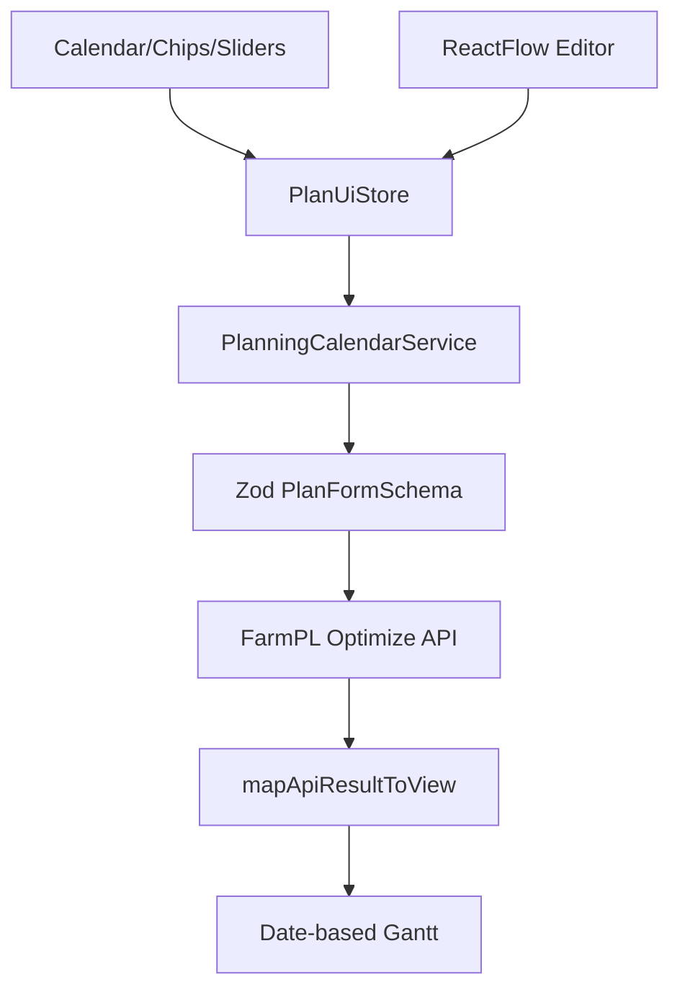

# Design Document

## Overview

営農現場のユーザー視点で日付ベースの操作を実現するため、プランニングUIのデータモデルを「UIドメイン（実日付）」と「APIドメイン（0起点日数）」に分離する。UI層ではカレンダーやレンジスライダーを用いた直感的な入力を提供し、ドメイン変換レイヤーで既存の最適化APIスキーマに整合する日数配列へ変換する。イベント編集はReactFlowを中心にしたワークフロー視覚化に集約し、詳細パネルの折りたたみで複雑さを軽減する。ガントチャートは開始日を基準に実日付軸へ変更し、フィルタUIを簡素化する。

## Steering Document Alignment

### Technical Standards (tech.md)
- Next.js + Reactの既存スタックを維持し、追加ライブラリは軽量な `date-fns` と `react-day-picker` のみとする。
- Zodによるバリデーションを継続利用し、日付→日数変換後に既存スキーマへ投入して互換性を確保する。
- クライアントのみで完結する処理とし、セキュリティ要件（ローカル変換／情報非保持）を満たす。

### Project Structure (structure.md)
- `ui/lib/domain/` 配下に日付変換ユーティリティとUIドメイン型を追加し、既存の`types/` と `validation/` を尊重したレイヤリングに沿う。
- `ui/app/(planning)/components/` では大型コンポーネントを分割し、単一責務を徹底する（例: `HorizonSection`、`AvailabilitySection`、`EventDetailsPanel`）。
- `usePlanningStore` をUIドメイン用のストアとし、APIドメイン構造は変換ユーティリティ経由で取得する設計に更新する。

## Code Reuse Analysis

### Existing Components to Leverage
- **`PlannerShell`**: レイアウトコンテナは既存のまま利用（ローディングやヘッダの振る舞いを再利用）。
- **`EventGraphEditor`**: ノード・エッジ操作基盤は活かし、接続イベント時のコールバックで新しい条件編集パネルへ通知する。
- **`mapApiResultToView` / `useGanttData`**: タイムライン整形ロジックを拡張し、日付軸算出に活用する。

### Integration Points
- **API最適化エンドポイント**: 送信前に `buildApiPlanPayload` を置き換え、UIドメインからAPIドメインへ変換した構造を渡す。
- **ローカルストレージドラフト**: 保存形式をUIドメインへ移行し、ロード時に同じストアへ復元する。

## Architecture

UI全体を「UIドメイン状態（PlanUiState）→変換サービス→APIドメイン（PlanFormState）」に整理する。日付入力は汎用コンポーネント（カレンダー、レンジスライダー、チップベースの配列入力）で構成し、ReactFlow連携でイベント編集を視覚化する。ガントチャートは取得したタイムラインに開始日を適用して日付ラベルを生成する。

### Modular Design Principles
- **Single File Responsibility**: 変換ユーティリティ、カレンダーUI、イベント詳細などを個別ファイルへ分離し、巨大な `StepSections.tsx` を段階的に再構成する。
- **Component Isolation**: 入力コンポーネントは `props` 経由でUIドメイン構造を受け取り、ローカル状態を持たない。
- **Service Layer Separation**: `lib/domain/planning-calendar.ts`（仮称）で日付↔日数変換、期間再計算、依存補正を集中管理する。
- **Utility Modularity**: 配列→チップUIの操作は `useArrayField` フックなどの共通ユーティリティに切り出す。



## Components and Interfaces

### PlanningStore (更新)
- **Purpose:** UIドメイン（PlanUiState）を保持し、API送信時に変換を呼び出す。
- **Interfaces:** `usePlanningStore(selector)`、`export const planningDraftStorage`。
- **Dependencies:** `PlanningCalendarService`、`zod` バリデーション。
- **Reuses:** 現行の保存・送信・ローディングロジック。

### HorizonSection（新規）
- **Purpose:** 計画開始日・終了日を日付レンジピッカーで入力し、`totalDays` を自動計算。
- **Interfaces:** `onChange({ startDate, endDate })`。
- **Dependencies:** `react-day-picker`、`PlanningCalendarService.recalculateHorizon`。
- **Reuses:** 既存StepSections内のバリデーションメッセージやレイアウトスタイル。

### AvailabilitySection（新規）
- **Purpose:** 土地・作業者・リソースの封鎖期間をレンジスライダー／チップUIで管理。
- **Interfaces:** `onRangesChange(entityId, ranges)`。
- **Dependencies:** `DateRangeInput`, `PlanningCalendarService.rangesToDayIndices`。
- **Reuses:** 既存のエンティティ追加・削除ハンドラ。

### EventDetailsPanel（新規）
- **Purpose:** ReactFlowで選択したイベントの詳細（開始/終了日、ラグ、必要リソース）を折りたたみ可能なUIで編集。
- **Interfaces:** `onUpdate(eventId, patch)`、`onLinkChange(targetId, sourceId)`。
- **Dependencies:** `Accordion`（自作簡易コンポーネント）、`PlanningCalendarService.eventDateConversions`。
- **Reuses:** `EventGraphEditor` の `onUpdateDependency`。

### GanttChart（更新）
- **Purpose:** 日付軸でスケジュールを表示。従来のフィルタを廃止し、水平スクロールを有効化。
- **Interfaces:** `startDate`（UIストアから供給）。
- **Dependencies:** `date-fns` でラベル生成。
- **Reuses:** `useGanttData` のデータ加工ロジック。

## Data Models

### PlanUiState
```
interface PlanUiState {
  horizon: {
    startDate: string; // YYYY-MM-DD
    endDate: string;   // YYYY-MM-DD
    totalDays: number; // endDate - startDate + 1
  };
  crops: Array<{
    id: string;
    name: string;
    category?: string;
    price?: { unit: 'a' | '10a'; value: number };
  }>;
  lands: Array<{
    id: string;
    name: string;
    area: { unit: 'a' | '10a'; value: number };
    tags: string[];
    blocked: DateRange[]; // { start: string; end: string | null }
  }>;
  workers: Array<{
    id: string;
    name: string;
    roles: string[];
    capacityPerDay: number;
    blocked: DateRange[];
  }>;
  resources: Array<{
    id: string;
    name: string;
    category?: string;
    capacityPerDay?: number;
    blocked: DateRange[];
  }>;
  events: Array<{
    id: string;
    cropId: string;
    name: string;
    startDates: string[]; // YYYY-MM-DD
    endDates: string[];
    precedingEventId?: string;
    lag?: { min?: number; max?: number };
    requiredRoles: string[];
    requiredResources: string[];
  }>;
  preferences: ... // 既存構造を踏襲
  stages: ...
}
```

### PlanningCalendarService 出力例
```
interface PlanConversionResult {
  apiPlan: PlanFormState; // 既存型
  validationIssues: ZodIssue[];
}
```

### DateRange モデル
```
interface DateRange {
  start: string; // inclusive
  end: string | null; // null の場合は horizon end を意味する
}
```

## Error Handling

### Error Scenarios
1. **開始日 > 終了日**
   - **Handling:** HorizonSectionで即座にエラー表示、`onChange` を拒否。
   - **User Impact:** カレンダー下部に赤字で「終了日は開始日以降を選択してください」。

2. **ブロック期間が計画範囲外**
   - **Handling:** PlanningCalendarServiceが変換前に範囲をクリップし、警告をイベントログに返す。
   - **User Impact:** UIでトースト表示し、クリップ後の値がフォームに反映。

3. **日付変換失敗（タイムゾーンフォーマット不正等）**
   - **Handling:** 変換時に例外を捕捉し、`submissionError` に「日付入力を確認してください」メッセージを設定。
   - **User Impact:** 実行ボタン下のエラー表示で再入力を促す。

## Testing Strategy

### Unit Testing
- `PlanningCalendarService` の `dateToDayIndex`, `rangesToDayIndices`, `applyStartDateChange` をテーブル駆動テストで検証。
- `PlanUiState` から `PlanFormState` への変換が従来の`planFormSchema`に適合することを確認。

### Integration Testing
- `usePlanningStore` のドラフト保存/読込フローを `vitest` + `jsdom` でテストし、UIドメイン構造の整合性を確認。
- `RequestWizard.handleRun` をモックfetchで呼び出し、変換→検証→APIリクエストの一連の流れを検証。

### End-to-End Testing
- 主要ユーザーストーリー（計画期間設定→封鎖日範囲入力→イベント依存設定→最適化実行→ガント表示）をPlaywright想定の手動テスト項目として `tests/planning-ui.md` に追加し、将来の自動化フックを明記。
