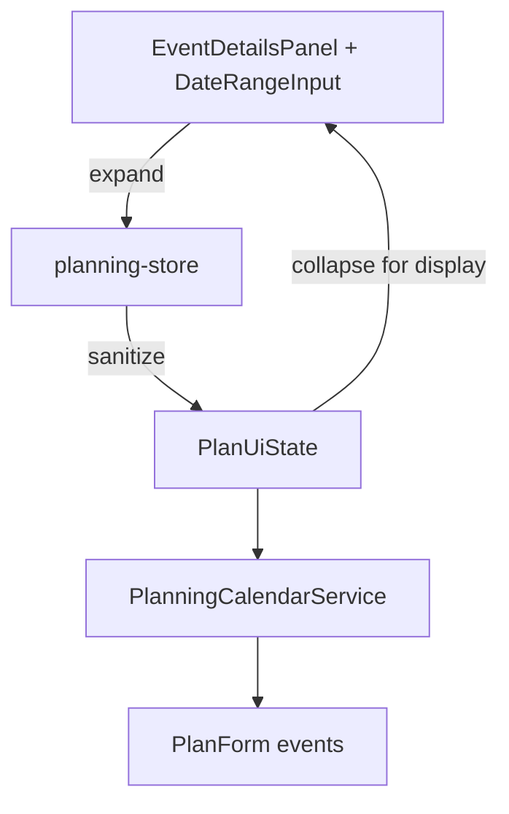

# Design Document

## Overview

イベントの開始・終了条件を配列に単一日付として保持する既存仕様を維持しつつ、UIではレンジ入力を提供する。レンジ入力は保存時に個々の日付の配列へ展開する。既存の `PlanUiEvent.startDates` / `endDates` および PlanForm 変換 (`startCond` / `endCond`) を再利用し、内部仕様変更を最小化する。

## Steering Document Alignment

### Technical Standards (tech.md)
- React/TypeScript における既存コンポーネント（`DateRangeInput`）を再利用し、DRYを徹底する。
- 状態管理（Zustand）側でデータサニタイズを行い、整合性を担保する既存パターンに従う。
- バリデーション/警告は`PlanningCalendarService`の既存ロジックを活用する。

### Project Structure (structure.md)
- UI層（`EventDetailsPanel`）でレンジ入出力を担当。
- 状態層（`planning-store`）で配列への展開・ソート・重複排除を実施。
- ドメイン変換層（`PlanningCalendarService`）は従来の配列処理を維持し、警告生成ロジックを再利用する。

## Code Reuse Analysis

### Existing Components to Leverage
- **`DateRangeInput`**: レンジ入力UIとしてそのまま利用し、イベント用の文言調整のみで対応。
- **`sanitizeDateList`**: `planning-store` 内で使用。レンジ展開後の配列に適用して昇順・重複排除を行う。
- **`PlanningCalendarService.convertToApiPlan`**: `startDates` / `endDates` をそのまま `startCond` / `endCond` に変換する既存処理を継続。

### Integration Points
- `EventDetailsPanel` → `onChange`: レンジ入力の追加・編集・削除時に配列を更新。
- `planning-store`: レンジ→配列変換ユーティリティを追加し、レンジ情報と配列情報の相互変換を担う。
- Draft保存/読込: `startDates` / `endDates` 配列が既存のままなので互換性を維持。

## Architecture

1. UIでは `DateRangeInput` を用いてレンジを編集。
2. 変更時にレンジを個々の ISO 日付配列へ展開（`expandRangesToDateList`）。
3. 展開結果を `sanitizeDateList` に通して昇順ソート・重複除去。
4. 表示時は `startDates` / `endDates` の配列をレンジへ圧縮（`collapseDatesToRanges`）して入力UIに表示。
5. `PlanningCalendarService` は配列をそのまま日数インデックスに変換する従来処理を維持。



## Components and Interfaces

### EventDetailsPanel.tsx
- **Purpose:** レンジ入力UIの提供と状態更新。
- **Interfaces:** `PlanUiEvent` が `startDates` / `endDates` の配列を保持。表示のために `collapseDatesToRanges` を使用。
- **Dependencies:** `DateRangeInput`, `PlanUiState`, レンジ/配列変換ユーティリティ。
- **Reuses:** 既存のSection/Field構造。

### planning-store.ts
- **Purpose:** レンジ→配列の展開 (`expandRangesToDateList`) と初期表示用のレンジ生成 (`collapseDatesToRanges`) を提供。
- **Interfaces:** `sanitizePlan` で `startDates` / `endDates` を正規化。
- **Dependencies:** `ISO_DATE_PATTERN`, `sanitizeDateList`, 日付差分計算ユーティリティ。

### planning-ui-types.ts / types/planning.ts
- **Purpose:** 追加プロパティ不要。既存の `startDates` / `endDates` を継続使用。

### PlanningCalendarService
- **Purpose:** `startDates` / `endDates` の配列をインデックスへ変換する既存処理を踏襲。新規コード変更は最小限（警告文調整が必要なら対応）。

## Data Models

既存の `PlanUiEvent` / `PlanFormEvent` モデルを変更しない。
```
PlanUiEvent {
  startDates?: IsoDateString[];
  endDates?: IsoDateString[];
  ... // 既存属性
}
```

## Error Handling

### Error Scenarios
1. **レンジ内に不正な日付が含まれる**
   - **Handling:** 展開時にISOチェックを行い、不正値は除外・警告。
   - **User Impact:** UI警告で通知し、保存は継続される（不正日付は除外）。

2. **レンジが計画地平線外**
   - **Handling:** 展開時に地平線内にクリップし、クリップが発生した場合に警告を追加。
   - **User Impact:** レンジ表示ではクリップ後の日付が表示され、警告が示される。

## Testing Strategy

### Unit Testing
- `expandRangesToDateList` と `collapseDatesToRanges` の往復テスト。
- `sanitizeDateList` 適用後に重複・ソートが維持されることを確認。

### Integration Testing
- `planning-store` の draft 保存・読込で配列→レンジ→配列の整合性を検証。
- `EventDetailsPanel` レンダリングテストで、複数日付がレンジにまとめられて表示されることを確認。

### End-to-End Testing
- 任意（UI E2Eが整備されていれば）レンジ入力→最適化実行のシナリオを追加。
