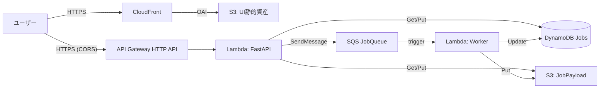
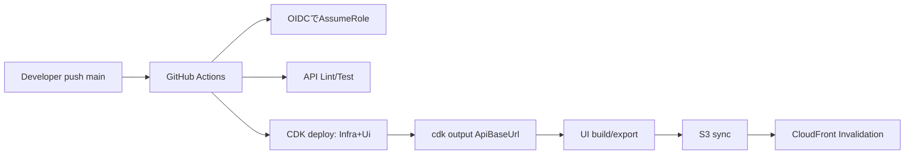

# デプロイ構成

- ドメイン: AWS提供のドメインのみ（独自ドメインは未使用）
- リージョン/アカウント: ap-northeast-1 / 111111111111 (秘密)
- UI: S3 + CloudFront（OAI）。Next.jsは静的書き出し（`ui/out`）
- API: API Gateway(HTTP API) → Lambda(FastAPI/Mangum)
- ジョブ: DynamoDB + S3 + SQS + Worker Lambda
- 認可: `AUTH_MODE=api_key`、API鍵は Secrets Manager(`ApiKeysSecret`) から読込
- TTL: DynamoDB TTL=365日、S3ライフサイクル=365日
- CI/CD: GitHub Actions（OIDC AssumeRole）。main pushで再デプロイ

---

## 図解（システム構成）



（ASCII版）

```
Browser ──HTTPS──> CloudFront ──OAI──> S3(UI)
   │                         └─────────────┐
   └──HTTPS(CORS)──> API Gateway ──> Lambda(FastAPI)
                                   ├─ SQS: SendMessage
                                   ├─ DynamoDB: Jobs R/W
                                   └─ S3: Job payload R/W
SQS ──trigger──> Lambda(Worker) ──> DynamoDB/S3 を更新
```

---

## CDKスタック（実体）

- UiStack
  - `UiBucket`（S3, BlockPublicAccess, SSE）
  - `UiDistribution`（CloudFront, OAI, 403/404→`index.html`）
  - 出力: `UiDistributionDomainName`, `UiDistributionId`, `UiBucketName`

- InfraStack（ap-northeast-1）
  - `ApiFunction`（`lambda_handler.handler`）
  - `HttpApi`（CORS: CloudFront配信ドメインを許可）
  - `JobsTable`（DynamoDB, PK=`job_id`, TTL=`expires_at`, PITR有効）
  - `JobPayloadBucket`（S3, ライフサイクル365日）
  - `JobQueue`（SQS, DLQ付き）/ `WorkerFunction`（SQSイベント）
  - `ApiKeysSecret`（Secrets Manager, 空で作成→後から投入）
  - 出力: `ApiBaseUrl`, `JobsTableName`, `JobPayloadBucketName`, `JobQueueUrl`, `ApiKeysSecretArn`

- CicdStack
  - GitHub OIDC Provider
  - `GithubDeployRole`（`zwire-farmpl-deploy`。初回のみ人手でデプロイ）

---

## APIランタイム設定

- 主要な環境変数
  - `AUTH_MODE=api_key`（本番）/ `none`（開発）
  - `API_KEYS_SECRET_ARN`（デプロイ時に注入）
  - `JOB_BACKEND=dynamo`
  - `JOBS_TABLE_NAME`, `JOB_PAYLOAD_BUCKET`, `JOB_QUEUE_URL`, `JOBS_TTL_DAYS=365`
  - `CORS_ALLOW_ORIGINS`（UiStackのCloudFrontドメイン）

- Secretsの読込ロジック（実装済み）
  - `API_KEYS` が未設定なら `API_KEYS_SECRET_ARN` から `{"keys":[...]}` を取得
  - 取得失敗時は空（＝保護エンドポイントは401）

---

## CI/CD（main push）



- Variables（GitHubリポジトリ）
  - `AWS_REGION=ap-northeast-1`
  - `AWS_ROLE_TO_ASSUME=arn:aws:iam::111111111111:role/zwire-farmpl-deploy`

---

## ローカル/手動デプロイの補助

- Dockerがない環境向け（実装済み）
  - `./scripts/build-lambda.sh` で `api_dist/` を作成 → `-c usePrebuilt=1` で `InfraStack`/`UiStack` をデプロイ
  - 例: `npx cdk deploy InfraStack UiStack -c usePrebuilt=1 --require-approval never`

- 特定スタックのみデプロイ（Docker回避）
  - 例: `npx cdk deploy CicdStack -c only=CicdStack`

---

## コスト/運用メモ

- CloudFront/S3/API Gateway/Lambda/SQS/DynamoDB はすべて従量課金。独自ドメイン未使用のためACM/Route53の追加コストは発生しません。
- 監視の起点: CloudWatch Logs（API/Worker）、SQS DLQ、Lambda失敗率、DynamoDBスロットリング

---

## 出力値と確認

- `ApiBaseUrl`（例: https://xxxxxxxx.execute-api.ap-northeast-1.amazonaws.com/prod/）
- `UiDistributionDomainName`（例: dxxxxxx.cloudfront.net）
- 健康確認: `${ApiBaseUrl}healthz` → `{ "status": "ok" }`
- CORS: UIドメインからのAPI呼び出しが許可される（許可リストにCDKで自動注入）
