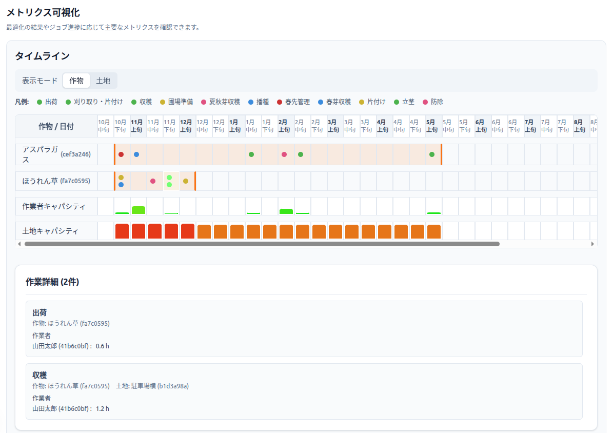

## FarmPLとは

様々な制約事項を加味した作付けスケジュールと労働計画を自動で作成するツールです。

アプリへ

<a class="md-button md-button--primary" href="{{ (environment.get('APP_URL') if environment else None) or (config.extra.app_url if config.extra and config.extra.app_url else '#') }}" target="_blank" rel="noopener">アプリを開く</a>

**試用版（プレビュー）**

※現時点では実験的な公開状態という位置づけです。このアプリを利用した結果に関する責任は負いかねます。

---

## こんな方におすすめ

- 家族や少人数で多品目を栽培していて、作業が重なる時期の調整が大変
- 圃場や人手に限りがある中で、できるだけムダや無理を減らしたい
- 「だいたい最適」でいいから、計画づくりの手間を省きたい

---

## できること・できないこと

### できること

FarmPLは次のような計画を自動で提案します。

- **作業時期の自動配置**  
  播種・定植・収穫など、作物ごとに必要な作業を適切な時期に並べます。

- **圃場面積の自動配分**  
  各圃場の上限を守りながら、作物ごとの面積を割り振ります。

- **人手と機械の調整**  
  1日の作業量が人数や機械の能力を超えないように調整します。

- **作業ピークの分散**  
  特定の日に作業が集中しすぎないよう、全体をならします。

### できないこと（現時点）

- 天候や病害虫の自動予測
- 資材の自動発注や在庫管理
- 日数や品目が非常に多い場合の即時計算（数分以上かかる場合あり）
- 完全な利益最大化の保証（入力条件の範囲内での最適化）

---

## 使い方

### ステップ1：計画期間を決める

まず、何日分の計画を作るかを決めます。  
デフォルトは1年です。作物の栽培開始から完了までをカバーできる長さが必要となります。
長くしすぎると計算に時間がかかります。

### ステップ2：圃場の情報を登録

使える圃場と、その面積を登録します。
タグは圃場のカテゴリを表すもので、複数付与することができます。タグは後の制約付与の際に便利です。
また、「この期間は作業できない」という日を圃場ごとに設定することもできます。

### ステップ3：作業者の情報を登録

1日に使える作業時間の目安（例：1人あたり8時間）と、作業できる人数を入力します。  
作業に必要な「役割」（例：管理者、アルバイトなど）がある場合は、役割ごとの人数も入れられます。
こちらも圃場のタグと同様に複数付与することができ、後の制約付与の際に役立ちます。

### ステップ4：機械などのリソースを登録

機械など（例：トラクター、選別機）の台数・使用可能時間の上限を入力します。

### ステップ5：作物を登録

育てたい作物をテンプレートから選びます（例：ほうれん草、レタス、ミニトマトなど）。
自分で定義することもできますが、後に作型を選ぶ関係で、テンプレートあら選択することをおすすめします。
価格は適当な値が入っているため、適宜設定してください。

### ステップ6：制約を設定

登録した作物について、どの程度の面積で栽培したいか、あるいはどの圃場で栽培したいかの意思がある場合は制約として設定できます。
最適化計算の中では単価の高い作物が優勢になるため、収益性を一部無視して作りたい作物などがある場合はこちらで制約をかけておきます。

また、最適化計算の評価指標の調整も可能です。
最適化は「収益性」「労働の最小化」「作付けの集約」「品目の多様性」の順に優先的に評価されますが、「柔軟性」を与えることでこれらのバランスを多少チューニングすることができます。たとえば収益を重視せず労働時間を減らしたい場合は、「収益性」の値を大きくすることで収益の最適性に余裕を与えられ、その幅の中で労働時間を短くするように工程が調整されます。

### ステップ7：作型と作業計画を登録

登録した作物について、作型を設定します。
一般的な作型はテンプレートから選択できます。

作型ごとに大雑把な作業計画が設定されているので、必要に応じて微調整していきます。
地域や時期などに応じて適宜調整してください。

フロー図に作業の繋がりが表現されるので、これを操作して作業の内容や作業間の関係を記述します。
マウス操作でコネクタを繋げることで作業の前後関係を記述することができます。

また、各作業の詳細ではいろいろな情報を設定可能です。

**基本情報**

- カテゴリ: 播種/灌水/収穫などの作業種別を選択肢から選びます。
- 名称: 作業の名称です。任意の名前をつけることが可能です。
- 土地を使用: 通常は作付け先の圃場を使用しますが、育苗や出荷作業など圃場を占有しない作業は「使用しない」にします。

**スケジュール・タイミング**

実行タイミングが先行作業に依存するかどうかで考え方が変わります。

- 先行作業がある場合
  - 最小間隔: 先行作業の終了から何日空ければ開始できるかを指定します。
  - 最大間隔: 先行作業の終了から何日以内に開始するかを指定します。
- 先行作業がない場合
  - 開始日: 作業を開始できる起点日を指定します。
  - 終了日: 作業を実行完了しなければならない締切日を指定します。
- 共通
  - 繰り返し頻度: 同じ作業を最低でも何日空けて実行するかの制約がある場合は指定します。農薬の利用頻度に制約がある場合などに指定します。

**労働・リソース**

- 総工数(h/a): 作業完了までの面積あたりの必要作業時間を指定します。
- 必要人数: 最低2人以上など制約がある場合は指定します。指定しなくても1人以上は割り当てられます。
- 日最大工数(h): 1日の作業上限がある場合は指定します。毎日1時間など、長期間作業を続けたい場合に使います。
- 必要役割: 割り当て可能な作業者の役割を明示する場合は指定します。
- 必要リソース: 利用が必要な機械などのリソースをカテゴリ単位で指定します。

### ステップ8：最適化を実行

「最適化を実行」ボタンを押すと、自動で計算が始まります。  
早ければ数秒、時間がかかる場合は数十秒〜数分です。

### ステップ9：結果を確認する

カレンダーやガントチャートで、作業予定を日ごとに確認できます。
圃場ごとの面積配分、作物ごとの面積、作業のピーク（混雑する日）なども表示されます。  
気になるところがあれば、条件を変えて再計算してみましょう。

---

## 注意点とチューニング

### よくあるエラーと対処法

#### 計画が作れない（解が見つからない）
- 期間が短すぎないか確認
- 使えない日（ブロック日）が多すぎないか確認
- 作業者人数や機械の上限が厳しすぎないか見直し
- 面積の下限（最低面積）を高くしすぎていないか確認

#### 計算に時間がかかる
- 計画期間を短くする、作物数を減らす
- 共有資源（機械）や役割の種類を少なくする
- 非同期モード（実行→後で結果を見る）を使う

### チューニングのコツ

- まずは「現実的に達成できる条件」を入れる。無理のない上限・下限から始めましょう。
- 作物の収穫時期を少し広めに（幅を持たせて）おくと、計画が立てやすくなります。
- ピーク（作業集中日）を抑えたいときは、人数を少し増やすか、作付けの開始時期をずらすのが効果的です。

---

## 内部の仕組み

### どんな情報を使っているか

- 作物ごとの作業（播種→定植→収穫など）
- 圃場の面積と、使えない日
- 1日に作業できる人数や役割
- 共有する機械の台数や使用可能時間

### 守っているルール

- 圃場の面積は、合計でその圃場の上限を超えない
- 1日の作業量は、人数や時間の上限内に収まる
- 必要な役割が足りない日は、その作業を入れない
- 機械の台数を超えて同時に使わない
- 作付けの占有期間は、圃場を使える日だけで組む

### 目指している「良い計画」の基準

1. 作業が一日に集中しすぎないこと（ピークをならす）
2. 圃場の使い方が偏りすぎないこと
3. 必要な面積の仕事がちゃんと終わること

---

### 数式での説明（再現可能な定式化）

ここでは、そのまま再実装できる粒度でモデルを記述します。日付の集合を \(T=\{1,2,\dots,H\}\)、圃場 \(L\)、作物 \(C\)、イベント \(E\)、作業者 \(W\)、機械資源 \(R\) とします。

#### スケール（内部単位）
- 面積スケール \(S_a=10\): 1単位 = 0.1a（`AREA_SCALE_UNITS_PER_A`）
- 時間スケール \(S_t=10\): 1単位 = 0.1h（`TIME_SCALE_UNITS_PER_HOUR`）

#### パラメータ（抜粋）
- 圃場面積: \(area_l\) [a]
- イベントの総労働量: \(L_e\) [h/a]
- イベントの日次上限: \(cap^{day}_e\) [h/日]（任意）
- 作業者の1日上限: \(cap^{day}_w\) [h/日]
- 資源の1日上限: \(cap^{day}_r\) [h/日]（任意）
- 役割要件: \(reqRoles_e \subseteq Q\)
- 必要資源カテゴリ: \(reqCat_e \subseteq \mathcal{K}\)
- イベント許容日: \(A_e \subseteq T\)（開始/終了から導出）
- 頻度（間隔）: \(f_e\)（任意）
- 先行イベントとラグ: 先行 \(p(e)\)、\(L^{min}_e, L^{max}_e\)（任意）
- 圃場/作業者/資源のブロック日集合: \(B^L_l, B^W_w, B^R_r \subseteq T\)
- 価格: \(price_c\) [円/a]
- 面積下限/上限（任意）: \(minArea_c, maxArea_c\) [a]
- 固定面積（任意）: タグ \(\tau\) ごとの \(fixedArea_{\tau,c}\) [a]

#### 変数
- 基準面積（包絡）: \(b_{l,c} \in \mathbb{Z}_{\ge 0}\)［単位: 0.1a］
- 日次面積: \(x_{l,c,t} \in \mathbb{Z}_{\ge 0}\)［単位: 0.1a］
- 作付け使用フラグ: \(z_{l,c} \in \{0,1\}\)
- 占有（作物×日）: \(occ_{c,t} \in \{0,1\}\)
- 占有（土地×作物×日）: \(occ^L_{l,c,t} \in \{0,1\}\)
- イベント実施: \(r_{e,t} \in \{0,1\}\)
- 労働時間: \(h_{w,e,t} \in \mathbb{Z}_{\ge 0}\)［単位: 0.1h］
- 割当フラグ: \(assign_{w,e,t} \in \{0,1\}\)
- 資源時間: \(u_{r,e,t} \in \mathbb{Z}_{\ge 0}\)［単位: 0.1h］
- 作物使用フラグ: \(use_c \in \{0,1\}\)

注: 実装では必要な日だけ変数を生成するスパース化を行います（性能最適化）。

#### 面積と土地容量
1) 上限（ブロック含む）

\[\sum_{c} x_{l,c,t} \le S_a\, area_l,\quad x_{l,c,t}=0\ (t\in B^L_l)\]

2) 使用フラグ・基準面積との連動（`LinkAreaUse`）

\[x_{l,c,t} \le S_a\, area_l\, z_{l,c},\quad x_{l,c,t} \le b_{l,c}\]

3) 占有が有効かつ非ブロックなら等値

\[occ^L_{l,c,t}=1 \land t\notin B^L_l \Rightarrow x_{l,c,t}=b_{l,c}\]

#### 占有の導出（`EventsWindow`）
1) イベント可否日: \(t\notin A_e \Rightarrow r_{e,t}=0\)

2) 頻度 \(f_e>1\): 任意の長さ \(f_e\) の窓で  

\[\sum_{\tau=t}^{t+f_e-1} r_{e,\tau} \le 1\]

3) ラグ（先行 \(p\), \(L^{min},L^{max}\)）

\[t-L^{min}<1 \Rightarrow r_{e,t}=0\]

\[r_{e,t} \le \sum_{\tau=\max(1,\,t-L^{max})}^{t-L^{min}} r_{p,\tau}\]

直近 \(L^{min}\) 日は重複不可:  

\[r_{e,t}+r_{p,\tau} \le 1\quad (\tau\in[t-L^{min}+1,\,t])\]

4) 作物占有（最初の使用〜最後の使用の閉包）
プレフィックス/サフィックス変数を用いて、\(occ_{c,t}=1\) を「最初の使用から最後の使用まで」の区間として導出：

\[occ_{c,t} \le prefix_{c,t},\ occ_{c,t} \le suffix_{c,t},\ occ_{c,t} \ge prefix_{c,t}+suffix_{c,t}-1\]

5) 土地レベル占有との整合

\[occ^L_{l,c,t} \le occ_{c,t},\quad occ_{c,t} \le \sum_l occ^L_{l,c,t}\]

#### 占有中の面積一定（`HoldAreaConst`）
連続する占有日には日次面積を一定に：

\[occ^L_{l,c,t-1}=occ^L_{l,c,t}=1 \land t,t-1\notin B^L_l \Rightarrow x_{l,c,t}=x_{l,c,t-1}\]

#### 労働（`Labor`）
総労働量の厳密一致（分数スケール）:  

\(L_e\) [h/a], \(S_t/S_a\) の比を既約分数 \(p/q\) とすると、

\[q\sum_{w,t\in A_e} h_{w,e,t} = p\sum_{l} b_{l,\,c(e)}\]

日次制約と割当：

\[\sum_w h_{w,e,t} \le S_t\, cap^{day}_e\, r_{e,t}\quad(\text{任意パラメータ})\]

\[h_{w,e,t} \le S_t\, cap^{day}_w\, r_{e,t},\quad h_{w,e,t} \le S_t\, cap^{day}_w\, assign_{w,e,t}\]

\[assign_{w,e,t} \le r_{e,t}\]

必要人数：

\[\sum_w assign_{w,e,t} \ge people\_req_e\cdot r_{e,t}\]

作業者の一日上限：

\[\sum_e h_{w,e,t} \le S_t\, cap^{day}_w\]

#### 資源（`Resources`）
資源毎の日次上限：\(\sum_e u_{r,e,t} \le S_t\, cap^{day}_r\)。  

イベントに資源カテゴリが必要な場合：

\[\sum_{r\in reqCat_e} u_{r,e,t} \ge \sum_w h_{w,e,t}\]

#### 役割（`Roles`）
各必須役割 \(q\in reqRoles_e\) について：

\[\sum_{w:\,q\in roles_w} assign_{w,e,t} \ge r_{e,t}\]

該当役割の作業者がいない日は \(r_{e,t}=0\)。

#### 面積の下限/上限（`AreaBounds`）

\[minArea_c \le \sum_l b_{l,c} \le maxArea_c\quad(\text{定義されている場合})\]

作物使用フラグと占有の存在：

\[z_{l,c} \le use_c,\quad use_c \le \sum_l z_{l,c},\quad \sum_t occ_{c,t} \ge use_c\]

#### 固定面積（`FixedArea`）
タグ \(\tau\) に属する圃場集合 \(L_\tau\) に対して：

\[\sum_{l\in L_\tau} b_{l,c} \ge fixedArea_{\tau,c}\]

#### 占有の整合（`OccEqualize`）
土地×作物を使うと決めたら（\(z_{l,c}=1\)）作物占有と一致：

\[z_{l,c}=1 \land t\notin B^L_l \Rightarrow\ occ^L_{l,c,t}=occ_{c,t}\]

#### 目的関数（段階最適化：`planner.py`）
1. 利益最大化：\(\max\ \sum_{l,c} price_c\, b_{l,c}\)
2. 労働時間最小化：\(\min\ \sum_{w,e,t} h_{w,e,t}\)
3. 分散度最小化：\(\min\ \sum_{l,c} z_{l,c}\)
4. 非土地イベントの活動日数：\(\min\ \sum_{c,t} a_{c,t}\)（\(a_{c,t}\) は非土地イベントの当日活動指標）
5. 早さ：\(\min\ \sum_{e,t} t\, r_{e,t}\)
6. 占有日数：\(\min\ \sum_{c,t} occ_{c,t}\)
7. 多様性最大化：\(\max\ \sum_c use_c\)

段階ロック（許容率 \(\tau\)）：直前段の最良値 \(v^*\) に対し、

- 最大化段: \(obj \ge \lfloor v^* (1-\tau)\rfloor\)
- 最小化段: \(obj \le \lceil v^* (1+\tau)\rceil\)

（段別の \(\tau\) 指定がある場合はそれを優先）

#### 直感でつかむポイント

- 面積や時間は「上限を超えない／必要量を満たす」ように自動で配分されます
- 「占有」という考え方で、作付け中の区間は面積が一定に保たれます（グラフで見ると平らな帯になります）
- 役割や機械の条件をつけると、実際の現場の都合（資格が必要、機械が足りない日がある）を反映できます

---

## お問い合わせ

ご意見や不具合のご連絡は、以下のいずれかでお願いします。

- **GitHub**: <a href="https://github.com/zwire/farmpl/issues" target="_blank" rel="noopener">Issues</a> からお知らせください
- **メール**: zwire.v1@gmail.com

※ 返信には数日いただく場合があります。操作がわからないときは、できれば画面のスクリーンショットを添付してください。
